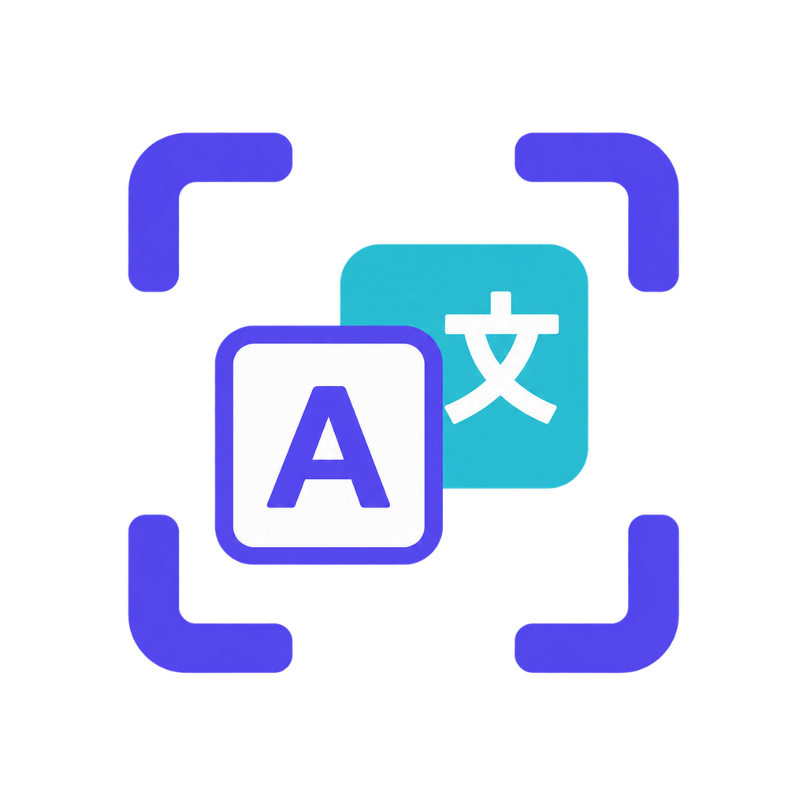

# Polyglance



一个以 Rust 为共享内核、使用平台原生技术实现桌面体验的跨平台翻译工具。

“Polyglance”取“多语言内容，一眼看懂”之意。

## 当前状态

macOS 第一条可运行纵向切片已经实现：

- Rust 翻译内核，默认使用免 Key 的 Microsoft 免费翻译，并支持 Google 免费翻译、构建内置的免费 AI 翻译及自定义 OpenAI-compatible AI
- UniFFI Swift 绑定
- SwiftUI/AppKit 菜单栏和悬浮翻译窗口
- 默认 `Option+D` 取词并翻译、`Option+Shift+D` 仅取词；全局快捷键可在设置中修改
- Accessibility 直接读取选区，失败时自动模拟复制并恢复剪贴板
- 默认 `Option+1` 打开高分辨率截图工具、`Option+2` 贴出剪贴板图片、`Option+3` 长截图、`Option+4` 区域录屏、`Option+5` 恢复最近关闭的贴图
- 框选后使用纯系统图标工具栏，悬浮时只显示简短动作名称；支持画笔/矩形/椭圆/箭头/文字/自由涂抹马赛克、撤销重做、复制、保存、置顶、OCR 和 OCR 翻译
- 截图阶段提供 Retina 放大镜、像素坐标及 HEX/RGB 取色；`C` 复制颜色，`Shift+C` 切换格式
- 选区支持八向编辑、框外点击扩展和按输出像素的键盘微调
- Vision 离线 OCR，并可像 PixPin 一样直接在识别原图上连续拖选、复制或拖出文字；识别框默认不打扰画面，选中文字后才显示“复制 / 翻译”，并支持 `Command+C` 复制选中、`Shift+C` 复制全文。截图翻译使用选区邻近的原文+译文结果卡，可切换原图/原文/译文
- 长截图从截图工具栏进入后立即采集当前选区，无需再次点击开始；当前只开放稳定的纵向模式，支持向上或向下滚动。无文字信息的缩略图会随拼接内容按比例增长并标出当前画面。复制或贴图会自动完成拼接并退出。区域 MP4/GIF 录屏采用蓝框准备、倒计时、红框录制/橙框暂停和停止后回放流程
- 普通图片、OCR 文字与 OCR 翻译贴图统一管理：支持右键菜单、双击关闭、批量隐藏/显示/关闭/销毁和进程内恢复历史；右键或空格可重新进入画笔、图形、箭头、文字、马赛克标注，标注工具条独立附着在图片下方，不遮挡图片内容
- 新安装默认使用 Microsoft 免费翻译，不要求先配置 API Key；所有内置服务都不向用户索取 Key，只有用户主动选择 DeepSeek/OpenAI 等“自定义 AI”时才显示配置项；AI 翻译默认流式输出，可在设置中关闭
- Google 与 Microsoft 免费翻译直接使用免 Key 接口；免费 AI 的服务凭据由发布者在构建阶段注入，自定义 AI 的 API Key 使用 Keychain 存储
- macOS 本地 `.app` 打包脚本
- Sparkle 2 安全自动更新，以及 tag 驱动的 GitHub Actions 构建/发布链路

### 发布与安装

项目默认采用免费、未公证的 GitHub Release 分发，不要求维护者加入 Apple Developer Program。首次从浏览器下载时，macOS 可能会提示应用来自互联网，或要求在 Finder 中右键“打开”一次；确认后可正常使用和接收 Sparkle 更新。完整发布与安装说明见[发布文档](docs/RELEASING.md)。

## 技术方向

- 共享内核：Rust
- macOS：SwiftUI + AppKit + Rust
- Windows：C# + WinUI 3 + Rust
- macOS 绑定：UniFFI / XCFramework
- Windows 绑定：C ABI + .NET `LibraryImport`

## 文档

- [完整项目方案](docs/PROJECT_PLAN.md)
- [macOS 开发说明](docs/MACOS_DEVELOPMENT.md)
- [PixPin 功能对照与实施路线](docs/PIXPin_FEATURE_PARITY.md)
- [品牌与 Logo 说明](docs/BRANDING.md)
- [macOS 发布与自动更新](docs/RELEASING.md)

## 快速开始

```bash
./scripts/build-macos-app.sh
open "dist/Polyglance.app"
```

## 核心原则

1. Rust 只承载真正能够跨平台复用的业务逻辑。
2. 划词、OCR、快捷键、悬浮窗口和凭据存储由各平台原生实现。
3. 先完成一个可靠的 macOS MVP，再接入 Windows，不同时开发两个 UI。
4. 第一版保持克制，不做 Bob 或 Easydict 的完整复刻。
