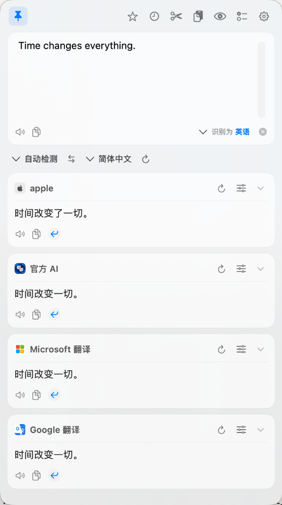

# Polyglance

**基于原生技术构建的跨平台翻译与屏幕效率利器。一套快捷键，划词即译、离线 OCR、长截图拼接、区域录屏与桌面贴图，内存常驻 < 30 MB。**

<p align="center">
  <a href="https://github.com/ldjx7/Polyglance/releases/latest">
    </a>
  <a href="https://github.com/ldjx7/Polyglance/actions/workflows/release-macos.yml">
    </a>
  
  
  
  
  
  <a href="LICENSE">
    </a>
  <a href="https://github.com/ldjx7/Polyglance/releases">
    </a>
</p>

纯原生技术栈打造（macOS 基于 Swift / SwiftUI，Windows 基于 C# / .NET 9 / WPF，核心基于 Rust），**零臃肿 Web 视图**，告别 Electron，绝不上报用户隐私与屏幕数据。内置开箱即用的免费翻译服务与系统原生离线 OCR 识别。免费、透明开源，且始终如一。

官网主页：[https://polyglance.pages.dev](https://polyglance.pages.dev)

<p align="center">
  
</p>

---

## 核心特性

- **极速划词翻译与原位替换** — 全局划选文字按下 `⌥D` / `Alt+D` 原地弹出流式气泡；按下 `⌥R` / `Alt+R` 直接将译文替换原文本，多语言写作与代码国际化无需反复复制粘贴。
- **系统级原生离线 OCR** — 深度集成 Apple Vision 与 Windows Media OCR 原生神经引擎，数据 100% 本地运算不出机。支持原地双语对照（`⌥S` / `Alt+S`）与分词点选复制（`⌥C` / `Alt+O`）。
- **多二维码并发识别与解析** — 截屏区域内任意数量二维码秒级同步侦测定位。深度解析 Wi-Fi 配置并一键复制密码，支持网页 URL 快捷访问与结构化名片协议。
- **智能滚动长截图** — 滚动网页、代码或长聊天记录时自动对齐与拼接特征像素，轻松生成完整高分辨率长图，支持二次标注与快速导出。
- **高清区域录屏与音频内录** — 自由框选指定窗口或区域，快速录制高清 MP4 视频或轻量 GIF 动图；支持系统内部声音内录与麦克风旁白同步收音，配备独立录屏面板。
- **像素级取色与桌面贴图** — 截图时按 `C` 放大镜精确取色并复制 HEX / RGB；剪贴板图片或截图一键置顶悬浮在屏幕最前端（`⌥W` / `Alt+V`），支持历史贴图顺序恢复。
- **开箱即用，免配 API Key** — 默认内置免费翻译渠道，安装即可直接翻译；同时支持自由接入 DeepSeek、OpenAI、Claude 等自定义大语言模型。
- **行业经典按键预设方案** — 内置 Snipaste 与 PixPin 两套行业经典按键预设方案，无需改变原有肌肉记忆，一键无缝迁移。

---

## 下载与安装

前往 [GitHub Releases 最新发布页](https://github.com/ldjx7/Polyglance/releases/latest) 下载对应系统的安装包：

| 操作系统 | 适用架构 | 推荐产物 | 说明 |
| :--- | :--- | :--- | :--- |
| **macOS** 14.0 或更高版本 | Apple Silicon / Intel 通用 | `Polyglance-<version>-macOS.dmg` | 拖入「应用程序」文件夹即可运行 |
| **Windows** 10 / 11 | 64 位 x64 架构 | `Polyglance-<version>-Windows-x64-Setup.exe` | 推荐安装版，支持快捷方式与自动升级 |
| **Windows** 10 / 11 | 64 位 x64 架构 | `Polyglance-<version>-Windows-x64-Portable.zip` | 绿色便携版，解压即用，配置保存在本地 |

### macOS 首次打开提示已损坏或无法打开？

因 Polyglance 为免费开源工具，未向 Apple 购买每年 99 美元的商业公证，系统 Gatekeeper 机制会对网络下载应用标记隔离属性。可通过以下三种方式正常放行：

1. **方法一（系统设置放行·推荐）**：关闭报错弹窗（切勿点击「移到废纸篓」），前往「系统设置 → 隐私与安全性」，在安全性区域点击「仍要打开」(Open Anyway) 并确认。
2. **方法二（访达快捷右键）**：在访达「应用程序」目录中，按住 <kbd>Control</kbd> 键点击 Polyglance 并选择「打开」，在随后弹出的提示中点击「打开」即可永久加入白名单。
3. **方法三（终端解除隔离）**：打开「终端」运行以下命令清除隔离属性：
   ```bash
   xattr -cr /Applications/Polyglance.app
   ```

---

## 系统权限说明

为了让全局划词与屏幕捕获功能正常工作，需在系统中授予以下必要权限：

- **辅助功能 (Accessibility)**：用于全局划词选区获取、模拟写入替换文本及快捷键监听。
- **屏幕录制 (Screen Recording)**：用于截图捕获、离线 OCR 识别、长截图特征采集与区域录屏。

---

## 快速上手

1. **划词翻译**：选中文本后按下 `⌥D` (macOS) 或 `Alt+D` (Windows) 唤出流式翻译气泡；按下 `⌥R` / `Alt+R` 直接替换原文。
2. **离线 OCR 与截图翻译**：按下 `⌥S` / `Alt+S` 框选区域即时翻译；按下 `⌥C` / `Alt+O` 提取离线文字并点选复制。
3. **桌面贴图**：截图完成后点击工具栏贴图图标，或按下 `⌥W` / `Alt+V` 将剪贴板图片置顶悬浮在屏幕最前端。
4. **切换快捷键方案**：前往「偏好设置 → 快捷键」，可一键切换为 Snipaste 经典方案或 PixPin 经典方案。

---

## 技术架构与从源码构建

Polyglance 采用「共享核心 + 双端原生」的现代桌面应用架构：

- **Core**：采用 Rust 实现网络传输、流式响应解析、凭据加解密管理与跨平台数据模型。
- **macOS**：纯 Swift 6 / SwiftUI / AppKit 深度开发，集成 Apple Vision 框架与 Sparkle 自动更新。
- **Windows**：纯 C# / .NET 9 / WPF 开发，调用 Windows Media OCR 与 Win32 原生交互接口。

### 本地构建

#### macOS 构建要求
- macOS 14.0 或更高版本
- Xcode 16+ 与 Swift 6.1
- Rust 1.80+ (`cargo`)

```bash
# 构建 macOS 开发版本
./scripts/build-macos-app.sh

# 运行应用
open "dist/Polyglance Dev.app"
```

#### Windows 构建要求
- 64 位 Windows 10 / 11
- .NET 9 SDK (`dotnet`)
- Rust toolchain (`stable-x86_64-pc-windows-msvc`)

```powershell
# 运行完整单元测试
dotnet test apps\windows\Polyglance.sln --configuration Release

# 构建已发布应用
.\scripts\build-windows-app.ps1 -Version "0.0.8" -BuildNumber "1"

# 构建安装包与便携 ZIP
.\scripts\build-windows-installer.ps1 -Version "0.0.8" -BuildNumber "1"
.\scripts\build-windows-portable-update.ps1 -SourceDirectory "dist\windows" -DestinationPath "dist\installer\Polyglance-0.0.8-Windows-x64-Portable.zip"
```

---

## 参与贡献

欢迎提交 Issue 与 Pull Request！在提交代码前，请确保：
1. 本地单元测试全部通过（macOS: `swift test --package-path apps/macos`，Windows: `dotnet test`）。
2. 代码风格清晰自然，保持原生轻盈特性，避免引入不必要的第三方重量级依赖。

---

## 开源协议

本项目采用 [MIT 许可证](LICENSE) 开源发布。
