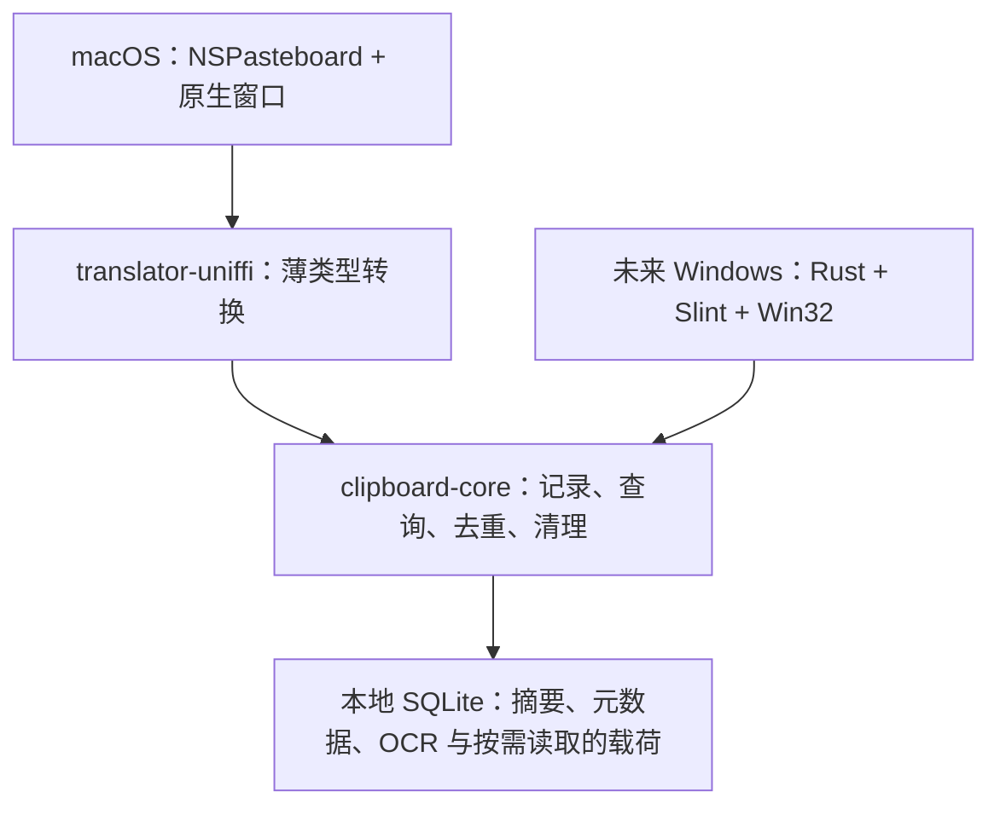

# 剪贴板历史：功能清单与技术方案

## 1. 目标与范围

为 Polyglance 增加可搜索的本地剪贴板历史，将复制内容与现有贴图、OCR、二维码识别和翻译功能连接。macOS 先实现；Windows 等新 UI 稳定后接入。两端共享历史规则，系统剪贴板和交互分别实现。

开发分支：`feat/clipboard-history`，基于 `main`。

Windows 技术依据：已检查 `refactor/windows-rust-track` 的实际工程，其中 `crates/polyglance-desktop` 使用 Rust + Slint 1.18，Windows 系统能力使用 Win32 / `windows` crate，已有 `arboard` 依赖。本方案不在旧 C# / WPF 客户端中实现新功能，也不把重构分支整体合并进来。该分支的 `CROSS_PLATFORM_ARCHITECTURE.md` 仍描述 WPF，Windows 规划以用户指定的新方向及实际 Cargo 配置为准。

本次实现从功能设计出发，未复制 Maccy 源码。未来如复用 Maccy 的 MIT 代码，必须保留版权声明与许可证，并审查所引入依赖。

## 2. 功能清单

下表覆盖第一版及本次后续实现。代码和自动验证结果见 `CLIPBOARD_HISTORY_VALIDATION.md`；跨应用和权限交互仍需 Mac 实机验收。

| 功能 | 当前 macOS | Windows 计划 | 验收标准 |
|---|---|---|---|
| 主动开启历史保存 | 已实现，默认关闭 | 设置页独立开关 | 开启前和暂停期间不收集；开启时不导入当前旧内容 |
| 文字历史 | 已实现 | 同一 Rust 核心 | 保留换行和空格，按最近复制时间排序 |
| 格式化文字 | 已实现 plain + HTML + RTF | 适配系统格式 | 普通粘贴保留格式，纯文本粘贴只写 plain |
| 图片历史 | 已实现 PNG、TIFF 转 PNG | PNG / 系统位图转换 | 超限不记录，重启后可重新复制和贴图 |
| 去重 | 已实现 | 共用 | 相同纯文本/PNG 字节提升时间，不新增重复项；收藏状态保留 |
| 搜索 | 已实现文字、来源、名称、标签和 OCR 内容 | 共用 | 大小写不敏感，中文可检索，每页最多 100 条摘要 |
| 类型、来源、标签筛选 | 已实现，可组合查询 | 共用 Rust 查询，Slint 控件 | 图片或文件筛选也能找到包含该类型的多项记录 |
| 名称和标签 | 已实现 | 共用 | 名称最多 120 字符；最多 20 个标签，单标签最多 64 字符；去重后保留 |
| 收藏、取消收藏 | 已实现 | 共用 | 收藏优先显示，自动清理不删除收藏 |
| 删除、清理 | 已实现 | 共用 | 单条可删除；批量清理默认保留收藏，删除收藏须选择并确认 |
| 条数、容量、保留天数 | 已实现 | 共用 | 默认 500 条、256 MB、30 天；收藏计入容量但不自动过期 |
| 暂停 / 恢复 | 已实现 | 平台入口 | 暂停后仍能查阅已有历史，恢复不补录暂停期间内容 |
| 忽略来源应用 | 已实现 Bundle ID 列表 | 进程 / 应用身份映射 | 命中忽略列表的复制不落库 |
| 敏感标记过滤 | 已实现 | 适配原生标记 | 过滤 confidential / transient / autogenerated 等标记及自定义类型 |
| 快捷键和菜单入口 | 已实现 | Slint + Win32 快捷键 | 进入现有快捷键设置；新快捷键初始未分配，避免与 Maccy、旧配置冲突 |
| 键盘导航和复制 | 已实现 | Slint 对等交互 | 上下选择、Enter 复制、Esc 关闭、Option+Enter 粘贴 |
| 纯文本粘贴 | 已实现 | 对等交互 | Option+Shift+Enter；保留原文内容，去除富文本格式 |
| 自动粘贴 | 已实现，需辅助功能权限 | Win32 输入派发 | 返回原应用；目标切换或剪贴板被改写时中止模拟粘贴 |
| 历史图片贴图 | 已实现 | 复用新贴图模块 | 使用完整图片，预览缩略图不代替原图 |
| 图片 OCR | 已实现 | 复用新 OCR 模块 | 用户点击后执行；结果进入已有文字窗口，不自动翻译或上传 |
| 二维码识别 | 已实现 | 复用新识别模块 | 用户点击后执行；复用原有二维码结果窗口及打开确认 |
| 文字翻译 | 已实现 | 复用翻译模块 | 用户点击翻译后才调用翻译服务 |
| 临时复制、历史重放防回环 | 已实现 | 适配事件序号 | 划词时的临时复制/恢复和历史重放不污染历史 |
| 文件引用和多项剪贴板 | 已实现，保留顺序和格式 | Win32 文件列表和公共多项模型 | 每次最多 100 项，总载荷最多 16 MB；文件只保存 URL 引用，缺失时明确提示 |
| 多选和连续粘贴 | 已实现 | Slint 多选、Win32 目标与输入派发 | Command 点击或 Shift 选择；队列按列表顺序，每次快捷键发送一条；目标或剪贴板变化时停止 |
| 图片 OCR 搜索索引 | 已实现，默认关闭 | 复用新 OCR 模块 | 开启后逐张本机识别、缓存、可搜索；关闭停止后台处理；失败可手动重试 |
| 备份导出、合并和替换 | 已实现 | 公共 Rust API，Slint 文件对话框 | SQLite 一致快照；导入前检查版本和完整性；无效或超额收藏导致整个导入回滚 |
| 清理数量预览和损坏恢复 | 已实现 | 公共 Rust API | 清理前显示当前数量和内容大小；损坏数据库先保留私有副本，再从有效备份恢复 |
| 跨设备同步 | 本期不做 | 本期不做 | 历史库只保存在本机 |

推荐手动配置呼出快捷键为 Command+Shift+V；实际注册通过现有快捷键管理器，冲突按既有流程提示。设置位于历史窗口的齿轮按钮，可修改保存开关、容量、保留时间及忽略应用；全局快捷键位于现有偏好设置。

连续粘贴另有 `clipboardPasteNext` 快捷键，初始未分配。先从目标应用呼出历史，选择记录并加入队列，再回到目标应用逐次使用该快捷键；菜单和历史窗口也有下一条与取消入口。复制所选会写入多项剪贴板；纯文本粘贴按顺序以换行连接文字，包含文件或独立图片时拒绝。

数据菜单可导出 `.polyclipboard` 文件、预览备份并选择合并或替换。备份未加密，包含原始内容、收藏、名称、标签和 OCR 文本；文件历史只包含引用，不包含文件本身。导入后仍执行当前容量和过期规则，界面会报告新增、合并和清理数量。合并保留现有非空名称、合并标签和收藏，并按较新时间保留载荷格式。

## 3. 分层与数据流

### Rust 公共核心

新增独立 crate `clipboard-core`，不依赖 GUI、系统剪贴板或 UniFFI。

- 公共模型保留 `Input`，新增 `BundleInput` 和有序的 `ClipboardItem`、`Filter`、`Annotation`、`ClearPreview`、`BackupInfo`、`RestoreReport`。
- `History` 负责 SQLite 存储、组合查询、去重、收藏、元数据、OCR 缓存状态、自动清理、版本迁移及备份导入；不调用系统剪贴板或 OCR 引擎。
- 单项身份兼容第一版：SHA-256(kind + 纯文本 UTF-8 / PNG 字节 / 文件 URL)。多项身份按顺序加入每项类别、载荷长度和主要载荷，避免排列或边界歧义。纯文本相同的富文本记录合并，保留最近一次复制的格式、名称、标签、收藏与 OCR 缓存。不同编码的视觉相同图片可能形成不同记录；本期不引入感知哈希。
- 查询返回摘要和元数据，不返回图片或富文本载荷。全文归一化为小写后建立搜索列，查询同样归一化，使用字面子串匹配；支持分页，每页最多 100 条。
- 清理顺序：先删除过期的非收藏记录，再按复制时间删除最旧的非收藏记录，直到满足条数和内容字节预算。
- 收藏占满容量时拒绝新内容或过小的新设置，事务回滚；不会为腾空间删除收藏，也不会返回已自动删除的记录 ID。
- 限制：一条历史最多包含 100 个系统剪贴板项，总原始载荷默认最多 16 MB；多选重放同样受此限制。图片最多 1600 万像素，像素乘法检查溢出；OCR 文本每条最多 1 MB。历史上限可配置为 10000 条、2048 MB、3650 天，天数 0 表示不限。
- 容量统计包含载荷、搜索文本、摘要、来源、名称及元数据/OCR 搜索列；标签 JSON、来源归一化副本、SQLite 页、索引和文件系统开销另计，界面标为内容容量。

### SQLite 持久化

`entries` 存储 ID、指纹、类别、摘要、搜索列、来源、复制时间、收藏状态、名称、标签 JSON、OCR 文本及状态、项数和统计字节数；`representations` 存储 plain、HTML、RTF、PNG 与文件 URL 字节，以 `(entry_id, item_index, format)` 为主键，通过外键级联删除。

图片保存在 SQLite 的磁盘 BLOB 中，只有选择或执行操作时读取。当前界面仅解码一个最多 512 px 的预览；全文预览最多显示 20000 个字符，复制操作仍使用完整内容。

- schema v2：使用 `PRAGMA user_version`；v1 在事务内迁移，保留 ID、收藏和载荷。拒绝更高版本，避免旧程序破坏新库；打开时检查 SQLite 完整性和所需表结构。
- 插入/去重/格式替换/清理使用同一事务，修改设置失败不改变现有规则。
- `secure_delete=ON`，使用 DELETE journal 避免长期 WAL 保存载荷，删除后增量回收空闲页。
- macOS 创建私有目录 0700、数据库 0600，开发版与正式版通过 Bundle ID 使用不同目录。
- 数据库不做自定义加密。操作系统账户或备份可读取本地数据；删除不承诺对 SSD、系统快照或备份的取证级擦除。
- `backup.rs` 使用 SQLite 在线备份生成一致快照，先在目标目录生成并验证临时文件，再原子替换目标备份。恢复时逐条检查载荷并重建指纹和查询元数据，整个导入使用单个事务；无效内容或收藏容量冲突不会留下部分导入结果。
- OCR 状态分为待处理、完成、失败。图片内容身份去重时保留缓存；删除和过期通过外键清除载荷与条目元数据；失败项不会无限重试，用户可以显式重试。

### macOS 接入

`translator-uniffi::clipboard` 提供镜像类型和受 Mutex 保护的历史对象，只做类型转换、错误映射和转发。现有 `build-macos-core.sh` 自动生成 Swift 绑定；不手工编辑生成代码，仓库现有 `.gitignore` 排除生成物。

Swift 侧：

- `ClipboardHistoryWorker` actor：串行执行数据库操作，避免数据库 I/O 阻塞窗口和主线程。
- `ClipboardContentProcessor` actor：检查图片尺寸、TIFF 转 PNG、缩略图解码、逐张本机 OCR；重任务离开主线程，OCR 并发限制为一张。
- `ClipboardHistoryService`：读取系统剪贴板、适配平台格式、维护窗口状态，调用 Rust 规则。
- 开启后以 200 ms 间隔检查 `changeCount`，未变化不读载荷；最多 4 个在途快照，每个受单条字节预算限制，繁忙时保留最新变化待后续采样。轮询仍不能保证保留两次采样间所有快速复制内容。
- 在读取载荷前将来源和类型交给 Rust 策略过滤；写入时核心再检查一次。
- 图像先检查原生元数据和像素上限，再在 processor actor 中通过 ImageIO 编解码；原始 NSPasteboard 数据读取仍需主线程，应在真机核对延迟、快速复制和内存峰值。
- 来源是采样时前台应用的 Bundle ID，属于尽力识别，不保证异步复制、切换应用或 Universal Clipboard 的实际源应用身份。
- 原生 file URL 映射为公共 `text/uri-list` 文件引用，每项一条 URL；捕获和重放保留多项顺序。文件不存在时在改写剪贴板前拒绝。尚未支持的文件 promise 或包含不支持项的整次复制跳过。
- `ClipboardCaptureSuppression` 为划词复制兜底提供嵌套暂停，在恢复后跳过当前变化序号。
- 快捷键模型向后兼容增加 `clipboardHistory` 和 `clipboardPasteNext`，旧记录缺少字段时保持未分配，原有预设不增加新的快捷键占用；旧历史设置缺少 OCR 开关时保留原有设置并默认关闭索引。
- `ClipboardHistoryPanel` 使用 AppKit 非激活浮动窗口承载 SwiftUI，搜索时可获得键盘焦点，退出保留原应用作为粘贴目标。
- 窗口处理上下键和 Enter 前检查输入法组合状态，中文候选确认由输入法处理；复制和 OCR 操作阻止重复并发提交。
- 自动粘贴检查辅助功能权限、恢复目标前台应用，等待后再次检查目标和写入时的剪贴板序号，避免把内容误贴进其他应用。
- 连续粘贴以选中记录 ID 和目标应用组成内存队列；每次快捷键只处理一条。取消、恢复数据库、清理、目标切换或外部剪贴板变化会停止队列；派发前再次检查队列代次。
- 开启 OCR 索引后处理已有及新增图片，完成结果写回核心供搜索；关闭取消后台任务并保留已有索引。手动识别与索引共用串行 OCR，搜索使用 150 ms 防抖和请求代次丢弃旧响应。
- 手动 OCR 优先复用已有缓存；容量或磁盘问题导致索引保存失败时仍展示识别结果，后续可重新建立索引。
- 退出前停止监听并等待 actor 中已接受的存储操作完成。

### Windows 新架构规划

此功能分支不修改 C# 客户端；待 `refactor/windows-rust-track` 稳定后进行以下接入：

1. 在 `polyglance-desktop` 直接依赖 `clipboard-core`，无需通过 C ABI 或 UniFFI 访问历史核心。
2. 使用 Win32 `AddClipboardFormatListener` / `WM_CLIPBOARDUPDATE` 事件监听；系统格式转换可复用已有 `arboard`，富文本和敏感标记通过 Win32 适配。不要只依赖 `arboard` 的文字/图片接口而遗漏隐私元数据。
3. 将 plain/HTML/RTF/位图转换为公共表示；原生文件列表转换为有序 `ClipboardItem` 文件 URL 引用，不读取文件内容。统一来源标识应以稳定应用身份为准，并映射排除应用规则；与 macOS Bundle ID 的值域不同。
4. 历史引擎在后台 worker 中串行运行，通过 Slint 弱句柄与事件循环回送分页结果，查询使用序号丢弃旧响应。
5. Slint 实现历史列表、多选、类型/来源/标签筛选、名称编辑、详情、设置和备份对话框；数据库、查询、迁移、合并恢复共用 Rust API。OCR 引擎在后台逐张处理并调用 `store_ocr`，不在 Slint 事件循环中解码图片。
6. Win32 保存目标窗口并恢复前台，连续粘贴每次处理一条，系统输入派发前检查窗口身份、剪贴板序号和队列代次；保留 Win+V，新快捷键由用户设置。与系统历史独立保存，不读取 Win+V 历史数据库。
7. Windows 数据目录位于当前用户 LocalAppData 下，通过用户目录 ACL 限制访问。core 本身不操作平台注册表或窗口。
8. 合并时只迁入 `clipboard-core`、workspace 依赖及锁文件相关变更；解决 Cargo.toml 的成员冲突，保留重构分支已有 `model-core`、`polyglance-cli`、`polyglance-desktop`，不带入 macOS 假定的桥接结构。

## 4. 隐私与操作边界

- 默认关闭；显式开启后保存今后的复制内容。暂停和关闭不删除历史，用户可以清理。
- Rust 默认过滤 transient、concealed、autogenerated、1Password、KeeWeb 等标记；另可配置自定义类型和忽略应用。
- 过滤依赖源应用提供的标记和尽力识别的来源。普通文本密码、令牌等无法保证自动识别，因此提供暂停和排除应用，并在设置中说明。
- 不记录内容日志，不自动同步、不自动翻译。图片 OCR 搜索索引默认关闭，用户开启后才后台运行。
- 图片 OCR 是本机操作；只有用户点击翻译才进入现有在线翻译流程。导出备份时明确说明未加密及文件引用的含义。

## 5. 验证方案和完成标准

### 自动验证

- Rust：持久化、Unicode 搜索、富文本/文件/多项原样往返和顺序去重、过滤前置、组合筛选、名称/标签/OCR 缓存、容量回滚、过期策略、10000 条分页、v1 迁移、备份合并/替换/损坏/超额回滚、损坏库保留副本及恢复。
- macOS：默认关闭、旧设置向后兼容、真实 NSPasteboard 富文本/文件/多项桥接、缺失文件拒绝重放、TIFF 转 PNG 及 PNG 原样往返、纯文本多项合并、嵌套临时复制暂停、字节/像素超限拒绝、生成绑定持久化/元数据/OCR/备份恢复、真实 Vision OCR 和缩略图上限、窗口键盘焦点和关闭回调。
- `Clipboard History CI`：在 macOS 15 跑 Rust workspace 测试、开发应用完整构建、Swift 测试、代码签名检查并上传开发应用 ZIP；Windows runner 只验证公共 crate。
- macOS 本地命令：`./scripts/build-macos-app.sh`，随后 `swift test --package-path apps/macos --configuration release`，最后 `codesign --verify --deep --strict 'dist/Polyglance Dev.app'`。

### 合入前必须完成的实机检查

- 新安装默认不保存；开启/暂停/恢复/关闭后分别复制，核对收集行为。
- 从 Safari、Notes、Terminal、编辑器、图片应用及 Finder 复制，检查富文本、图片、多文件和顺序还原；删除或移动文件后重放应提示且不改写系统剪贴板。
- 复制受敏感标记保护的内容，核对不入库；在忽略列表加入实际应用并测试。
- 触发 Polyglance 划词临时复制，再使用历史重放，核对不增加伪记录。
- 多显示器、全屏应用中呼出、输入中文、上下选择、Esc、自动粘贴及未授权路径。
- 大图片、多次快速复制、10000 条记录、低磁盘空间和目录权限故障，检查延迟、内存和错误反馈。
- 重启应用核对持久化，收藏不被过期/容量自动清理；取消收藏后正常参与规则。
- 贴图使用原图；OCR 不触发翻译；二维码打开遵循现有确认流程。
- 开启图片 OCR 搜索索引，确认旧图片和新图片逐张建立索引；关闭时停止；失败重试、重启后缓存、搜索响应无错序。
- 多选加入队列，逐次粘贴到原应用；切换应用、外部复制、取消和恢复历史时中止；快捷键默认未分配。
- 导出、合并、替换与损坏库恢复；核对收藏/名称/标签/OCR 和文件引用。无效备份、超额收藏、低磁盘空间时现有历史保持完整。

## 6. 后续独立阶段

本次范围包括本地剪贴板管理的上述能力。以下仍作为独立阶段，不影响 macOS 本地功能：

- Windows Rust + Slint UI 接入及 Windows 原生格式、权限与粘贴实机验收。
- 跨设备同步和端到端加密：需先确定账户、密钥管理、冲突合并和敏感内容策略。
- 自动分类、智能摘要：需另行确定本机模型或在线服务及用户授权；不默认上传历史。
- 更高频采集与性能优化：依据 Mac 实机测量决定采样机制、队列预算和搜索索引方案，现有轮询不承诺捕获全部快速变化。

开发记录与 CI 结果另外记入 `CLIPBOARD_HISTORY_VALIDATION.md`。编译通过不等同于上述交互实机验证；本分支不打发布 tag。
