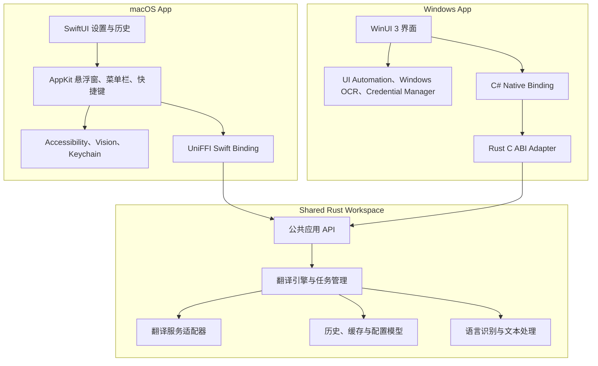

# Polyglance 项目方案

## 1. 文档信息

- 产品名：Polyglance
- 目录名：`native-translator`
- 文档状态：初版方案
- 目标平台：macOS、Windows
- 核心技术：Rust + Swift + C#

## 2. 项目结论

本项目采用“共享 Rust 内核 + 平台原生外壳”的架构：

- Rust 负责翻译流程、服务适配、文本处理、缓存、历史记录和错误模型。
- macOS 使用 SwiftUI 和 AppKit，负责菜单栏、全局快捷键、划词、悬浮窗口、OCR 和系统权限。
- Windows 使用 C# 和 WinUI 3，负责托盘、全局快捷键、UI Automation、悬浮窗口、OCR 和系统权限。
- macOS 通过 UniFFI 调用 Rust；Windows 通过稳定的 C ABI 和 .NET P/Invoke 调用 Rust。

这套架构优先保证原生体验，同时让最容易产生重复和行为差异的翻译业务逻辑只维护一份。

## 3. 产品定位

### 3.1 要解决的问题

做一个启动快、交互少、界面克制的个人桌面翻译工具。用户在任意应用中选中文字，通过一个全局快捷键完成翻译，并在轻量悬浮窗口中获取结果。

### 3.2 产品原则

1. 一次快捷键完成主要流程。
2. 默认界面只展示原文、译文和必要操作。
3. 不因多个翻译结果和复杂配置干扰阅读。
4. 网络请求、历史记录和错误处理行为在两个平台保持一致。
5. 平台交互遵循各自系统习惯，不追求 UI 像素级统一。
6. 用户的翻译内容和 API 密钥默认只留在本机及所选服务商。

### 3.3 MVP 功能

- 全局快捷键唤起翻译。
- 获取当前选中文本，失败时回退到剪贴板。
- 自动识别源语言。
- 配置一个目标语言。
- 支持一个大模型兼容服务和一个传统翻译服务。
- 支持流式显示（服务端具备流式能力时）。
- 复制译文。
- 最近翻译历史。
- 菜单栏或系统托盘入口。
- API 密钥存入系统安全凭据存储。
- 请求取消、超时、重试和清晰的错误提示。

### 3.4 MVP 明确不做

- 截图 OCR。
- 原图翻译。
- 插件市场。
- 云同步和账号系统。
- 团队功能。
- 多窗口工作区。
- 同时展示大量翻译服务结果。
- 浏览器扩展和移动端。
- 自动更新服务。

OCR 很重要，但它会显著增加权限、系统 API、错误处理和测试范围，因此放在第二阶段。

## 4. 总体架构



### 4.1 边界原则

Rust 内核不得依赖 AppKit、SwiftUI、WinUI 或 Windows UI Automation。

平台层不得自行实现翻译重试、服务降级、缓存键生成和历史数据规则。这些逻辑必须进入 Rust，否则两个平台会逐渐产生不同的行为。

### 4.2 Rust 负责的内容

- 翻译请求和结果的数据模型。
- 服务提供商接口及实现。
- HTTP 请求、流式响应解析、超时和重试。
- 语言代码规范化。
- 文本清理、长度检查和分段。
- 翻译任务状态、取消和并发限制。
- 历史记录和缓存。
- 配置数据模型及迁移。
- 统一错误类型。
- 与 UI 无关的日志和诊断信息。

### 4.3 平台原生层负责的内容

- 应用生命周期。
- 菜单栏/系统托盘。
- 全局快捷键。
- 获取选中文本。
- 剪贴板。
- 悬浮窗口、焦点、多显示器和 DPI。
- OCR。
- 辅助功能、录屏等权限。
- Keychain/Credential Manager。
- 系统通知。
- 安装包、签名、公证和自动更新。
- 把 Rust 事件调度回 UI 主线程。

## 5. 推荐目录结构

```text
native-translator/
├── Cargo.toml
├── README.md
├── docs/
│   ├── PROJECT_PLAN.md
│   ├── adr/
│   └── api/
├── crates/
│   ├── translator-core/
│   ├── translator-providers/
│   ├── translator-storage/
│   ├── translator-ffi/
│   ├── translator-uniffi/
│   └── translator-capi/
├── apps/
│   ├── macos/
│   └── windows/
├── tools/
│   └── translator-cli/
├── scripts/
│   ├── build-macos.sh
│   └── build-windows.ps1
└── .github/
    └── workflows/
```

建议先创建必要 crate，不在第一天建立全部空模块。理想的首批内容是：

```text
crates/translator-core
crates/translator-providers
crates/translator-uniffi
tools/translator-cli
apps/macos
```

## 6. Rust 模块设计

### 6.1 `translator-core`

纯业务层，不包含具体 UI 或平台 SDK。

核心模型建议如下：

```rust
pub struct TranslationRequest {
    pub id: RequestId,
    pub text: String,
    pub source_language: Option<LanguageCode>,
    pub target_language: LanguageCode,
    pub provider: ProviderId,
    pub mode: TranslationMode,
}

pub struct TranslationResult {
    pub request_id: RequestId,
    pub translated_text: String,
    pub detected_language: Option<LanguageCode>,
    pub provider: ProviderId,
    pub elapsed_ms: u64,
    pub cached: bool,
}
```

统一错误至少区分：

- 配置错误。
- 身份验证失败。
- 额度或限流。
- 网络不可用。
- 请求超时。
- 服务端错误。
- 返回格式错误。
- 请求被取消。
- 输入为空或过长。
- 本地存储错误。

UI 只根据错误类别决定展示内容，不解析服务商的原始错误字符串。

### 6.2 `translator-providers`

定义统一 provider 接口，每个服务商一个独立模块：

```rust
#[async_trait]
pub trait TranslationProvider: Send + Sync {
    async fn translate(
        &self,
        request: &TranslationRequest,
        events: &dyn TranslationEventSink,
    ) -> Result<TranslationResult, TranslationError>;
}
```

首版建议支持：

1. OpenAI-compatible：覆盖 OpenAI、OpenRouter 及兼容服务。
2. DeepL 或另一个具有明确翻译语义的服务。

Apple 系统翻译属于平台能力。如果以后接入，应由 Swift 层实现一个平台 provider，再通过接口回调提供给 Rust，而不是在 Rust 中调用未公开系统接口。

### 6.3 `translator-storage`

使用 SQLite 保存：

- 翻译历史。
- 非敏感设置。
- 翻译结果缓存。
- 数据库 schema 版本。

禁止保存：

- API 密钥。
- OAuth refresh token。
- 原始服务商认证响应。

API 密钥由平台层从 Keychain 或 Credential Manager 读取，只在运行时交给 Rust 使用。

### 6.4 `translator-ffi`

这是 Swift 和 C ABI 适配器共同依赖的稳定应用接口。它应隐藏内部 crate 拆分，使平台端只面对少量高层操作：

```text
create_engine
update_runtime_config
translate
cancel_translation
get_history
delete_history_item
clear_history
shutdown
```

## 7. macOS 实现方案

### 7.1 技术选择

- SwiftUI：设置、服务管理、历史记录。
- AppKit：菜单栏、无边框悬浮窗口、焦点控制、多显示器定位。
- Accessibility API：获取选中文本。
- NSPasteboard：剪贴板回退。
- Keychain Services：API 密钥。
- Vision：后续 OCR。
- UniFFI：Rust 到 Swift 的类型安全绑定。

### 7.2 获取文本流程


模拟复制可能修改用户剪贴板。实现时必须：

1. 保存原剪贴板内容。
2. 触发复制并等待剪贴板 changeCount 改变。
3. 读取文本。
4. 在不覆盖用户新操作的前提下恢复原剪贴板。
5. 设置明确的超时时间。

### 7.3 Rust 产物

Rust 静态库分别为 Apple Silicon 和 Intel 构建，打包为 XCFramework，再由 Xcode 链接。生成的 Swift binding 进入单独模块，业务 UI 不直接接触 C 类型。

第一版可以只构建 Apple Silicon，但构建脚本和目录结构不要假设永远只有单一架构。

## 8. Windows 实现方案

### 8.1 技术选择

- .NET + C#。
- WinUI 3：正式 UI。
- Windows App SDK：应用生命周期和窗口能力。
- UI Automation：获取选中文本。
- Windows Credential Manager：API 密钥。
- Windows OCR：后续 OCR。
- `LibraryImport`：调用 Rust DLL。

如果 WinUI 3 在悬浮窗口或托盘能力上产生明显阻力，可以让少量窗口代码调用 Win32 API，但不建议因此把整个 UI 改成 Win32。

### 8.2 C ABI 设计

Windows 侧不直接暴露 Rust 结构体。建议导出少量 `extern "C"` 函数，并用不透明 handle 管理生命周期：

```text
nt_engine_create
nt_engine_destroy
nt_translate_start
nt_translate_cancel
nt_history_query
nt_buffer_free
```

边界规则：

- 不把 Rust 引用或生命周期暴露给 C#。
- 不让异常或 panic 穿过 FFI。
- 所有内存由创建它的一方释放。
- 所有字符串明确使用 UTF-8。
- 复杂请求可使用版本化 JSON，避免大量脆弱的结构体 marshalling。
- 回调必须带 request ID，并记录线程约束。
- C# binding 把回调转换成 `Task` 或事件，UI 不直接处理裸指针。

对于本项目规模，版本化 JSON 的少量序列化成本可以忽略，换来的 ABI 稳定性更有价值。

## 9. 异步、流式和线程模型

Rust 内部维护 Tokio runtime，网络请求不占用 Swift/C# UI 线程。

建议事件模型：

```text
Started
DetectedLanguage
PartialText
Completed
Failed
Cancelled
```

规则：

- 每个事件都有 request ID。
- 平台 binding 收到事件后切换到 UI 主线程。
- 新的快捷键请求可以取消旧请求，也可以按设置并行执行。
- MVP 默认只允许一个前台翻译请求。
- `shutdown` 等待或取消仍在运行的任务。
- callback 生命周期由 binding 层持有，不让 Rust 持有已释放的 UI 对象。

## 10. 数据与配置

### 10.1 非敏感配置

- 默认源语言策略。
- 目标语言。
- 当前 provider。
- 快捷键。
- 窗口行为。
- 是否记录历史。
- 超时和重试策略。

### 10.2 敏感配置

- API key。
- OAuth token。
- 自定义服务的认证 header。

敏感配置只保存到平台安全存储。Rust 配置文件只保留一个逻辑引用，例如 `credential_id`。

### 10.3 数据目录

平台层向 Rust 提供应用数据目录，不让 Rust 自行猜测路径：

- macOS：Application Support 下的应用目录。
- Windows：LocalAppData 下的应用目录。

这样便于沙盒、测试和未来迁移。

## 11. 安全与隐私

- 日志默认不记录原文、译文和 API key。
- 错误日志中的 URL 必须移除 query token。
- 自定义 endpoint 只允许 HTTPS；开发模式可显式放宽。
- 数据库不保存密钥。
- UI 明确说明文本会发送到用户选择的第三方服务。
- 提供禁用历史记录和一键清空历史的能力。
- 所有 FFI 入口捕获 panic 并转换为稳定错误。
- 发布构建关闭可能泄露数据的调试日志。

## 12. 测试策略

### 12.1 Rust

- 模型和文本处理单元测试。
- provider 响应解析测试。
- 使用 mock HTTP server 测试超时、重试、限流和流式分片。
- SQLite migration 和缓存测试。
- 取消及并发测试。
- FFI panic 和无效输入测试。

### 12.2 macOS

- Swift binding smoke test。
- 快捷键和窗口状态测试。
- Accessibility 失败及剪贴板回退测试。
- 多显示器、全屏应用和不同 Space 下的手动验收。
- 权限拒绝、撤销和重新授权测试。

### 12.3 Windows

- C ABI 导出检查。
- C# binding 生命周期和内存释放测试。
- UI Automation 回退测试。
- 多显示器和不同 DPI 测试。
- x64/ARM64 包装和 DLL 查找测试。

### 12.4 跨平台契约测试

为相同请求准备固定测试向量，确保 Swift 和 C# binding 获得等价的数据、错误类型和状态事件。

## 13. 开发阶段

### 阶段 0：技术验证

目标：证明 Rust 内核能够同时被 Swift 和 C# 调用。

交付物：

- 最小 Rust workspace。
- Rust `translate_echo` 测试接口。
- Swift 调用静态库成功。
- C# 调用 DLL 成功。
- CI 至少完成 macOS 和 Windows 编译。

退出标准：两个原生示例程序都能调用同一 Rust API，并正确处理中文 UTF-8 和错误返回。

### 阶段 1：Rust 垂直切片

目标：不依赖 GUI，完成真实翻译闭环。

交付物：

- 核心请求和错误模型。
- OpenAI-compatible provider。
- 超时、取消和流式事件。
- CLI 工具。
- 单元测试和 mock server 集成测试。

退出标准：CLI 可以可靠完成真实翻译，失败时返回稳定错误类型。

### 阶段 2：macOS MVP

目标：完成日常可用的第一个产品版本。

交付物：

- 菜单栏应用。
- 全局快捷键。
- Accessibility 取词和剪贴板回退。
- 悬浮翻译窗口。
- 设置和 Keychain。
- 历史记录。

退出标准：在浏览器、终端、文本编辑器等常用应用中，可以通过一次快捷键完成翻译，不阻塞 UI。

### 阶段 3：Windows MVP

目标：复用稳定 Rust API，完成 Windows 原生外壳。

交付物：

- 托盘应用。
- 全局快捷键。
- UI Automation 取词和剪贴板回退。
- WinUI 3 悬浮窗口。
- Credential Manager。
- 安装包。

退出标准：Windows 与 macOS 使用相同的配置语义、历史格式、翻译行为和错误类别。

### 阶段 4：OCR 与产品化

目标：补充高价值平台能力并建立发布流程。

候选内容：

- macOS Vision OCR。
- Windows OCR。
- 截图选区。
- 自动更新。
- 崩溃诊断。
- 签名、公证和正式安装包。
- 第二个传统翻译 provider。

## 14. MVP 验收标准

- 冷启动后能够常驻菜单栏或托盘。
- 全局快捷键不会明显影响当前应用焦点。
- 能在主要文本应用中获取选区；失败时有剪贴板回退。
- 网络请求期间 UI 保持响应。
- 可以取消当前翻译。
- API 密钥不出现在普通配置、数据库和日志中。
- 相同错误在两个平台映射为同一错误类别。
- Rust core 的关键逻辑具有自动化测试。
- macOS 和 Windows binding 均通过内存生命周期测试。
- 清空历史后不残留可通过 UI 访问的记录。

## 15. 主要风险及处理方式

| 风险 | 影响 | 处理方式 |
|---|---|---|
| 跨语言异步 callback 生命周期错误 | 崩溃或内存泄漏 | binding 层统一持有 callback；使用 request ID；增加销毁测试 |
| 划词在不同应用中行为不一致 | 核心体验不稳定 | Accessibility/UI Automation 优先，剪贴板作为明确回退 |
| 同时开发两个平台拖慢项目 | MVP 长期无法完成 | 架构支持双平台，开发顺序坚持先 macOS 后 Windows |
| provider API 频繁变化 | 翻译不可用 | 每个 provider 独立模块，核心只依赖统一接口 |
| FFI 接口频繁修改 | 原生层维护成本上升 | 先用 CLI 稳定领域模型，再冻结第一版 FFI |
| 密钥或文本进入日志 | 隐私风险 | 默认脱敏，建立日志审查测试 |
| OCR 提前扩张范围 | 延迟 MVP | OCR 固定进入阶段 4，不进入第一版 |

## 16. 初步工作量判断

以下是单人开发的粗略量级，不作为承诺：

| 阶段 | 集中开发量级 |
|---|---:|
| 技术验证 | 2～4 天 |
| Rust 垂直切片 | 4～7 天 |
| macOS MVP | 8～15 天 |
| Windows MVP | 8～15 天 |
| OCR 与发布完善 | 8～20 天 |

真正耗时的部分会是划词兼容性、悬浮窗口细节、权限和发布，而不是翻译 API 调用。

## 17. 第一轮实施任务

建议后续按以下顺序进入编码：

1. 确定正式项目名、应用标识符和最低系统版本。
2. 初始化 Cargo workspace。
3. 建立 `translator-core` 的请求、结果和错误模型。
4. 编写 CLI 和 mock provider，验证完整调用链。
5. 实现 OpenAI-compatible provider。
6. 创建最小 macOS Swift App，并通过 UniFFI 调用 `translator-core`。
7. 建立 macOS 全局快捷键和悬浮窗口原型。
8. 完成 Accessibility 取词实验。
9. FFI 模型稳定后，再创建 Windows C ABI smoke test。

## 18. 编码前需要确认的产品决策

这些问题不阻塞当前方案，但应在阶段 0 开始前确定：

- 正式产品名和 bundle identifier。
- 第一优先平台是否确定为 macOS。
- macOS 和 Windows 最低支持版本。
- 第一个默认翻译服务。
- 是否默认记录历史。
- 是否需要流式输出。
- 目标语言是单一固定语言，还是快速切换。
- 项目是否开源，以及许可证类型。

## 19. 参考资料

- [UniFFI 用户指南](https://mozilla.github.io/uniffi-rs/)
- [UniFFI Swift bindings](https://mozilla.github.io/uniffi-rs/latest/swift/overview.html)
- [UniFFI 与 Xcode 集成](https://mozilla.github.io/uniffi-rs/latest/swift/xcode.html)
- [.NET P/Invoke source generation](https://learn.microsoft.com/dotnet/standard/native-interop/pinvoke-source-generation)
- [Rust FFI 文档](https://doc.rust-lang.org/nomicon/ffi.html)
