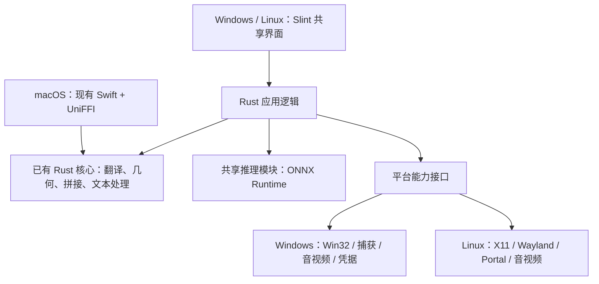

# Polyglance Windows / Linux Rust + Slint 重构方案

- 整理日期：2026-09-28
- 文档状态：重构方案与实施进度；截至 2026-09-28，双轨原型已运行，功能平替尚未完成
- 目标平台：Windows、Linux
- macOS：保留现有 Swift / SwiftUI / AppKit 实现及 UniFFI 接口
- 选型原则：优先保证适配兼容性、功能完整和跨平台体验，不以重构开发成本作为主要取舍依据；在此基础上控制基础包体积

## 1. 推荐结论与范围

采用 **Rust 共享业务逻辑 + Slint 共享主要界面 + 各平台系统适配** 的结构，逐步替换 Windows 的 C# / WPF 客户端，并建立 Linux 客户端。

Slint 作为新客户端的首选界面框架。渲染后端、截图遮罩和贴图窗口的实现方式，由第一阶段原型的兼容性测试决定。

### 1.1 已确定的方向

1. macOS 保持现有 Swift 实现，不迁移到 Slint。
2. Windows、Linux 共用 Rust 业务逻辑，尽量共用 Slint 界面和交互组件。
3. 基础应用不依赖 .NET 桌面运行时、WebView2 或 WebKitGTK。
4. 保留 ONNX Runtime CPU 推理能力，模型由用户按需安装。
5. 截图、录屏、窗口控制、快捷键和凭据等系统能力分别适配。
6. 迁移期间保留现有 WPF 客户端，满足验收条件后再正式替换。

免装运行时的验收含义是：用户无需额外安装应用运行环境，应用也不携带整套 .NET 或浏览器运行环境。Slint、ONNX 及其必要原生代码仍计入基础包体积；Linux 仍依赖所支持系统的基础桌面组件。

不预先承诺完整应用只有 5–10 MB，也不把单个 EXE 作为必须条件。

### 1.2 第一阶段需要确定的事项

- Slint 渲染后端及失败时的处理方式。
- Slint 窗口与平台接口能否共同满足透明、置顶、穿透、焦点和多屏要求。
- Linux 首批支持的发行版、最低版本、桌面环境和 CPU 架构。
- Windows 与 Linux 的完整原生依赖、基础包体积和系统兼容范围。
- Slint 及新增依赖的发行许可选择和声明方式。

### 1.3 与现有架构文档的关系

[跨平台架构规范](CROSS_PLATFORM_ARCHITECTURE.md)描述现有 Swift + WPF 架构，其中 Linux 范围、界面规模和部分平台能力判断需要重新核实。

本文件同时记录目标架构与当前原型进度。原型不能视为 WPF 客户端的正式替代品。实施时应同步更新现有架构规范，明确过渡期与迁移完成后的依赖边界。共享核心不依赖 GUI、避免重复业务实现、保持已有行为及真实环境验证等原则继续保留。

## 2. 当前项目基础

### 2.1 可以直接保留的部分

- `capture-core`：几何、布局、文本处理、长截图拼接和录制策略。
- `translator-core`：翻译数据模型与校验。
- `translator-providers`：服务接入、请求构造和响应解析。
- `translator-uniffi`：macOS 使用的绑定路径。
- `polyglance-cabi` 中已经用 Rust 实现的 Windows 捕获、系统 OCR 和部分录屏编码能力。

新 Rust 客户端应直接调用内部 Rust 接口。C ABI 保留为旧 C# 客户端的兼容入口，避免新客户端继续通过原始指针、JSON 和跨语言类型转换调用自己的 Rust 实现。

### 2.2 需要迁移的部分

检查时，Windows 的受版本管理 C# 与 XAML 源码约 30,000 行，不含测试：界面与交互约 21,000 行、平台功能约 6,500 行、数据模型与服务约 2,900 行。设置窗口的 XAML 与代码合计约 4,100 行。

这些数字只用于说明迁移范围，不作为工期估算。当前应用已有普通界面、复杂屏幕交互和持久化数据，迁移必须覆盖完整用户流程。

尤其需要处理：

- 标注、撤销重做仍使用 WPF `UIElement`，与界面实现耦合。
- OCR 前后处理、离线翻译、模型管理等仍有 C# 实现。
- 配置、历史记录、贴图存档、凭据和更新流程需要保持兼容。
- 当前排除 OCR 模型的构建开关还会影响 ONNX 文件与程序构建模式，应拆分职责。

### 2.3 已有产物的体积参考

以下来自本地 `Polyglance-0.1.0-Windows-x64-Portable.zip`，属于旧版本实测，不能当作当前源码重新构建后的结果。单位为十进制 MB。

| 内容 | 解压后 | ZIP 内压缩大小 |
|---|---:|---:|
| 整个应用 | 约 250 MB | 约 106 MB |
| OCR 模型及字典 | 约 15.6 MB | 约 14.4 MB |
| ONNX Runtime 相关文件 | 约 11.8 MB | 约 4.5 MB |
| 现有 Rust 核心 DLL | 约 11.2 MB | 约 4.0 MB |

现有包还包含 WPF、Windows Forms、.NET 基础库和 Windows SDK 托管程序集。移除 .NET 技术栈与分离模型是明确的减小体积方向；ONNX Runtime 本身可以保留。

正式基线必须重新构建当前版本，并按相同功能、相同模型范围、相同压缩方式比较。

2026-09-28 在真实 Windows 构建机上，0.1.4 源码生成了下列独立产物，单位为 MiB。Rust 预览包包含桌面程序、CLI、ONNX Runtime CPU DLL 和许可证，不包含 OCR 模型；旧版 WPF 包与预览版功能范围不同，数字只表示当前实际发布体积。

| 产物 | 大小 |
|---|---:|
| Rust 预览版未压缩目录 | 30.42 |
| Rust 预览版安装包 | 11.61 |
| Rust 预览版便携 ZIP | 13.88 |
| 旧版 WPF 安装包 | 71.53 |
| 旧版 WPF 便携 ZIP | 94.18 |

Rust 目录内的桌面 EXE 为 14.47 MiB，CLI EXE 为 4.90 MiB，`onnxruntime.dll` 为 11.03 MiB。这个结果不能用于宣称功能平替后的体积，也不能证明干净系统无需其他原生依赖。

## 3. 目标架构

### 3.1 模块职责

以下是建议的职责划分，名称可在实施时确定，不要求一开始拆成大量独立 crate。

| 模块 | 职责 | 依赖边界 |
|---|---|---|
| 共享桌面应用 | Slint 界面、窗口协调、启动与退出 | 组装应用服务和平台实现 |
| 应用逻辑 | 配置模型、历史规则、任务状态、模型管理、标注操作 | 不依赖 Slint 或具体系统 API |
| 现有共享核心 | 翻译协议、几何、拼接、文本处理、纯策略 | 保持无 GUI 和平台框架依赖 |
| 推理模块 | ONNX 调用、OCR 前后处理、离线翻译 | 不依赖平台位图和 UI 类型 |
| 平台接口 | 捕获、快捷键、窗口控制、凭据等能力契约 | 表达能力与结果，不暴露具体窗口类型 |
| Windows 实现 | Windows 系统接口与资源管理 | Windows 条件编译 |
| Linux 实现 | X11、Wayland、Portal 等适配 | Linux 条件编译 |
| 兼容绑定 | UniFFI、旧 C ABI 的类型转换与调用桥接 | 委托实际 Rust 实现 |

### 3.2 运行与数据边界

- UI 更新在界面线程执行，网络、推理、图像处理和编码任务在后台执行。
- 应用入口负责组装异步运行环境；共享纯逻辑不创建自己的运行时。
- 请求需要明确的取消、超时和结果归属，窗口关闭后不继续更新已失效界面。
- 新客户端不复用旧 C ABI 的原始指针接口作为内部应用接口。
- macOS 保持现有运行时与 UniFFI 路径，不引入 Slint 或新的 ONNX 依赖。
- 标注明确区分屏幕逻辑坐标、物理像素坐标和图片坐标，转换规则集中维护。
- 保留现有几何、文本偏移和像素接口的行为约定；需要改变时增加版本或兼容转换。
- 大图像与录屏帧优先复用缓冲区，避免不必要的转换；是否能减少拷贝需要测量，不承诺端到端零拷贝。

## 4. 界面与窗口策略

### 4.1 共用 Slint 的部分

- 翻译输入与结果窗口。
- 设置、历史记录、模型安装与管理。
- 截图工具栏、OCR 结果、标注工具属性。
- 贴图内容和可复用交互组件。

以 Fluent 风格为基础，统一字体层级、间距、颜色、图标、明暗主题和焦点状态。保留现有 WPF 版本的功能，迁移不以外观变化替代行为验收。

两平台可以保持产品视觉一致，同时分别处理快捷键显示、文件选择、权限提示等系统习惯。

### 4.2 特殊窗口的处理顺序

1. 验证 Slint 自带窗口能力。
2. 通过其原生窗口访问接口补充平台行为。
3. 对仍不满足兼容性要求的窗口，使用独立原生实现，并继续共用标注模型、业务逻辑和必要界面组件。

截图遮罩、贴图和原位翻译覆盖必须验证：

- 逐像素透明、置顶、鼠标穿透与不抢焦点。
- 多屏不同缩放比例、负坐标、显示器插拔和休眠恢复。
- 多个窗口同时存在时的焦点、输入路由、关闭顺序和资源释放。
- 原生接口与 Slint 事件循环之间是否产生状态冲突。

不要提前假定全部特殊窗口都需要原生重写，也不要假定 Slint 能覆盖所有平台行为。

## 5. 渲染后端选型

固定以 winit 为窗口后端，显式选择编译功能，避免构建环境意外引入 Qt。锁定经过验证的 Slint 版本，并检查其 Rust 工具链要求及对现有构建的影响。

第一阶段分别构建以下候选，暂不将所有渲染器打入正式包：

| 候选 | 验证重点 |
|---|---|
| FemtoVG OpenGL | 体积、OpenGL 驱动兼容性、文字质量、透明窗口 |
| FemtoVG WGPU | Direct3D / Vulkan 路径、设备兼容性、体积、多窗口资源 |
| Skia 对照版本 | 多语言显示、软硬件路径、兼容性收益与体积代价 |

Slint 自带软件渲染器的官方文档仍列有文字与绘图能力限制，不直接作为翻译工具的通用回退方案。需要回退时，应验证所选后端在目标设备上的实际行为。

Windows 和 Linux 可以使用不同渲染后端，共用相同 Slint 界面。

选择依据：

1. 中文输入法、候选框位置、多语言排版、字体回退、选区复制。
2. 普通显卡、旧驱动、远程桌面和硬件加速不可用的环境。
3. 透明窗口、多个贴图窗口、高分辨率与混合缩放。
4. 下载体积、安装体积、启动时间、空闲 CPU / 内存和操作延迟。

兼容性不满足要求时，不能仅凭体积小而选用该后端。

## 6. 共享逻辑迁移重点

### 6.1 提取已有 Windows Rust 实现

将 `polyglance-cabi` 中已有的 Windows 捕获、系统 OCR 和录屏编码实现迁入 Windows 平台模块。

旧 C ABI 继续提供原有入口和数据契约，转发到提取后的实现。新 Rust 客户端直接调用安全的内部接口。过渡期间通过旧客户端的测试和实际行为验证提取没有引入变化。

### 6.2 建立独立标注模型

用数据描述矩形、椭圆、箭头、文字、笔迹和马赛克等标注，不再使用 WPF 控件对象作为历史记录。

共享模块负责选中、移动、缩放、删除、撤销重做和序列化。界面绘制与图片导出使用相同的数据和几何规则，分别验证字体度量、抗锯齿等渲染差异。

### 6.3 应用逻辑与平台存储分离

共享配置校验、历史规则、模型下载和任务状态。数据目录选择、系统凭据加密、开机启动和安装更新分别适配。

Windows 需要兼容现有配置字段、历史记录、贴图存档、模型目录和 DPAPI 凭据。macOS 持久化方式保持现状，不为本次迁移强制统一存储实现。

## 7. ONNX、模型与部署依赖

- 基础包携带 ONNX Runtime CPU 推理库，OCR 和离线翻译模型按需安装。
- 模型管理记录版本、校验值与引擎兼容范围，处理取消、下载失败和损坏文件。
- 推理会话按需创建并复用，避免启动时加载全部模型或每次识别重新初始化。
- Windows 没有安装模型时保留系统 OCR；Linux 明确提示安装模型，其他功能仍可使用。
- 将模型是否随包分发、是否包含推理库、程序入口模式等构建选项分开。
- 暂不为压缩体积而裁剪算子或更换推理引擎；若以后裁剪，需要验证全部受支持模型。

现有 Windows `onnxruntime.dll` 依赖 Visual C++ 运行库。改用 Rust 不会自动消除该依赖。若不允许单独安装或附带 VC++ 运行库 DLL，应评估将相关支持代码静态链接的原生库构建方式，并检查最终全部依赖。

在未安装开发工具和额外运行库的干净系统中验证。开发构建机运行成功不能替代该项验收。

Linux 需要明确最低系统库版本和桌面组件要求。发行版安装包或便携形式在目标环境确定后选择，不承诺任意 Linux 发行版单文件运行。

## 8. Linux 平台能力设计

Linux 从第一阶段开始编译和运行，避免先完成 Windows 再追加 Linux 适配。

| 能力 | X11 验证方向 | Wayland 验证方向 |
|---|---|---|
| 屏幕捕获 | X11 捕获路径、多显示器与缩放 | Portal / PipeWire、授权与会话恢复 |
| 全局快捷键 | 注册、冲突与窗口管理器差异 | GlobalShortcuts Portal 的后端支持与用户配置 |
| 贴图与原位覆盖 | 位置、层级、透明度、穿透 | 桌面环境实际暴露的定位与窗口能力 |
| 获取选中文字、原位替换 | 应用配合与系统接口行为 | 无障碍、剪贴板及输入相关权限和限制 |
| 自动滚动长截图 | 滚动输入与捕获同步 | 输入控制权限与桌面支持范围 |
| 录屏与音频 | 捕获、音频与编码依赖 | PipeWire 会话、音频、编码与资源释放 |

应用需要检测能力，并根据环境提供对应交互。不能原位定位时提供普通结果或编辑窗口；不能自动滚动时评估手动滚动采集。每种降级行为都应可理解、可测试。

GlobalShortcuts Portal 已提供标准接口，ScreenCast Portal 支持持久化和恢复，但具体能力受桌面后端与版本影响。任意窗口绝对定位等能力仍不能在所有 Wayland 环境保证，界面框架无法消除这些差异。

录屏的捕获、音频和编码依赖在早期完成小规模验证，完整迁移放在后期。避免因后加入的编码组件改变整个应用的体积与部署条件。

## 9. 四阶段实施与当前进度

| 阶段 | 已实现并可检查的内容 | 尚未通过的验收项 |
|---|---|---|
| 一：双轨骨架与 CLI | C# CLI、Rust CLI、Rust + Slint 桌面原型；C# CLI、Rust CLI 和桌面程序各有独立发布路径 | Linux 原生桌面构建与运行、渲染后端对照、干净系统依赖和体积基线 |
| 二：纯 Rust 核心 | 六类标注数据、坐标转换、撤销重做及命中测试；Windows GDI 捕获、WinRT OCR 和 Media Foundation 编码的安全 Rust 入口；历史记录格式兼容测试 | 标注绘制及图片导出未接入界面；仍需对照旧客户端完整行为，核实配置和贴图数据迁移 |
| 三：首个 Windows 原型 | Win32 跨屏框选；Slint 翻译、服务商卡片、设置、历史、模型安装；用户选择的 PP-OCR ONNX 模型可在真实 Windows 上推理；DPAPI 凭据读取 | 真实图形会话中的中文输入法、混合缩放、焦点、置顶与穿透仍需人工验收；尚无干净系统依赖测试 |
| 四：功能平替 | 长截图手动滚动采集、贴图窗口、无声 MP4 录屏的初版入口 | WPF 功能逐项对照未完成，详见下表；Linux 系统捕获、窗口和录屏适配也未完成 |

当前 Slint 端只可作为独立预览版，不能替换现有 Windows 安装身份。Windows 与 Linux 共用 Rust 核心和 Slint 界面源码，但 Linux 的系统功能尚未达到可用范围。macOS 继续使用 Swift 客户端。细项见 [WPF 与 Rust + Slint 功能对照](RUST_SLINT_PARITY.md)。

### 9.1 阶段四剩余的实质功能

| 能力 | 当前状态 | 完成条件 |
|---|---|---|
| 截图标注 | 纯数据模型和撤销重做已有；缺绘制工具栏、编辑和带标注导出 | 六类标注的操作、视觉结果、导出和旧版逐项一致 |
| 长截图 | 手动滚动采集与拼接初版；没有自动滚动和交互预览 | 边界、重叠失败、取消和导出在真实屏幕验证 |
| 贴图 | 最近截图可置顶、可设穿透；缺拖动、缩放、历史和持久化 | 多窗口位置、状态、归档及旧数据兼容 |
| 模型管理 | 本地文件安装、校验值和 PP-OCR 推理已有 | 下载、取消、版本校验、损坏修复、离线翻译模型 |
| 录屏 | Windows GDI 抓帧与 Media Foundation 无声 MP4 初版 | 音频、硬件编码选择、长时间稳定性、预览和异常恢复 |
| 桌面集成 | 系统托盘、后台常驻、单实例唤窗和四个 Windows 全局快捷键初版；主窗改为接近 WPF 的白色卡片布局 | 托盘菜单与快捷键逐项图形验收、自启动、更新、完整服务商设置和视觉对齐 |
| Linux | 共用 CLI、模型和 Slint 代码 | X11/Wayland 捕获、权限、窗口能力、录屏及目标发行版验证 |

任何一项缺口都不能用编译成功或静态界面代替验收。功能平替必须建立 WPF 操作清单，按相同输入、相同平台条件逐项测试并记录结果。

## 10. 数据兼容与过渡发布

- 开发版使用独立应用身份、配置和数据目录，避免与现有客户端同时修改同一份数据。
- 测试迁移时读取旧数据副本，覆盖配置、历史、贴图、模型路径和受保护凭据。
- 正式迁移前备份，明确数据格式版本和失败恢复流程。
- 尽可能保留现有可兼容格式；格式必须改变时，明确旧版能否读取及回退方法。
- 新客户端达到既有功能与稳定性要求之前，保留 WPF 版本。
- Windows 安装身份、快捷方式、自启动与更新路径需要验证连续升级，不能只测试全新安装。
- 在实施前同步维护架构规范、构建说明和平台支持文档，使现状与目标有清晰区分。

## 11. 验收与构建要求

### 11.1 功能与兼容性

| 维度 | 必须覆盖的场景 |
|---|---|
| Windows | 目标 Windows 10 / 11 版本、普通显卡、远程桌面、渲染失败处理 |
| Linux | 选定发行版与版本、X11、GNOME Wayland、KDE Wayland及实际支持范围 |
| 文字与输入 | 中文输入法、多语言混排、选区复制、键盘导航和无障碍 |
| 多屏与窗口 | 混合缩放、负坐标、显示器插拔、休眠恢复、置顶、穿透、不抢焦点 |
| 屏幕工具 | 标注与导出一致性、长图、多贴图、原位翻译和资源释放 |
| 推理与模型 | 未安装模型、下载中断、文件损坏、模型兼容、取消任务 |
| 数据与更新 | 旧数据读取、备份恢复、连续升级和回退 |
| 性能与部署 | 完整包体积、启动、空闲资源、多窗口、干净系统依赖 |

### 11.2 测试与构建

- 保留现有 C# 和 Swift 行为测试，迁移期间不能通过删改断言掩盖行为变化。
- 共享逻辑在 Rust 中测试；平台接口和窗口行为在相应系统验证。
- Windows 在真实 Windows 环境完成测试、发布应用、安装包和便携 ZIP，遵守仓库规定的构建顺序。
- 窗口、输入法、权限和屏幕捕获在真实图形会话验收，不能以编译通过替代。
- Linux 从第一阶段建立持续构建与目标桌面验证，记录哪些能力通过、降级或不支持。
- 按仓库要求持续完成 macOS 开发应用构建和签名验证；共享核心或绑定变化时运行相应回归测试。
- 依赖版本、许可证、第三方声明和打包内容随发布一并记录。

原型已经开始迁移和构建，但完整性能与兼容性验收尚未完成。每次验证结果应记录对应平台、工具链、产物和运行场景。

### 11.3 本次实际验证记录（2026-09-28）

- macOS：Rust 共享核心测试通过；`dist/Polyglance Dev.app` 构建并通过代码签名验证。UniFFI 生成器需要 Cargo.lock 中其他目标平台的元数据，补齐并核对本机依赖缓存后以离线模式构建。
- 真实 Windows：`Polyglance.sln` 的 299 项 C# 测试通过；旧版应用、安装包及便携 ZIP 均已生成；独立 C# CLI 已发布。
- 真实 Windows：Rust 的标注、历史、模型、C ABI、桌面状态等测试通过；Media Foundation 测试实际编码出 MP4。Rust 桌面、CLI、预览安装包和便携 ZIP 已生成。
- 真实 Windows：预览版发布目录中的 CLI 使用随包携带的 ONNX Runtime DLL 与已有 PP-OCR 模型，从项目截图中识别出了文本。
- 未验证：Slint 窗口的真实图形交互、中文输入法候选框、混合 DPI、多屏穿透、Linux 目标桌面环境，以及无开发工具的干净 Windows 系统。

## 12. 首个里程碑的剩余验收目标

完成以下项目后，才能把 Windows、Linux 的 Slint 原型认定为首个跨平台里程碑：

1. 支持中文输入与取消请求的翻译窗口。
2. 代表性的设置页面与明暗主题。
3. 截图框选及不同屏幕缩放下的坐标处理。
4. 可编辑贴图，以及平台支持范围内的置顶、穿透和焦点控制。
5. 一次真实 ONNX OCR，含模型未安装时的处理。
6. Linux 快捷键、捕获授权、窗口能力与录屏关键依赖验证。

同时提交完整依赖清单、各候选渲染后端的体积和兼容性结果，以及 Windows / Linux 功能差异清单。根据这些证据确定正式后端和特殊窗口方案，再进入全面迁移。

## 13. 参考资料

以下官方资料在 2026-09-28 的方案讨论中核实，实施时应按锁定版本再次核对：

- [Slint Winit 后端与平台依赖](https://docs.slint.dev/latest/docs/slint/guide/backends-and-renderers/backend_winit/)
- [Slint 渲染器能力与限制](https://docs.slint.dev/latest/docs/slint/guide/backends-and-renderers/backends_and_renderers/)
- [Slint 控件样式](https://docs.slint.dev/latest/docs/slint/reference/std-widgets/style/)
- [Slint 原生窗口访问接口](https://docs.slint.dev/latest/docs/rust/i_slint_backend_winit/trait.WinitWindowAccessor)
- [Slint 许可说明](https://github.com/slint-ui/slint/blob/master/LICENSE.md)
- [winit 窗口接口及平台限制](https://docs.rs/winit/latest/winit/window/struct.Window.html)
- [XDG GlobalShortcuts Portal](https://flatpak.github.io/xdg-desktop-portal/docs/doc-org.freedesktop.portal.GlobalShortcuts.html)
- [XDG ScreenCast Portal](https://flatpak.github.io/xdg-desktop-portal/docs/doc-org.freedesktop.portal.ScreenCast.html)
- [ONNX Runtime 安装依赖](https://onnxruntime.ai/docs/install/)
- [ONNX Runtime 自定义构建](https://onnxruntime.ai/docs/build/custom.html)
- [现有跨平台架构规范](CROSS_PLATFORM_ARCHITECTURE.md)
- [仓库开发与构建要求](../AGENTS.md)
